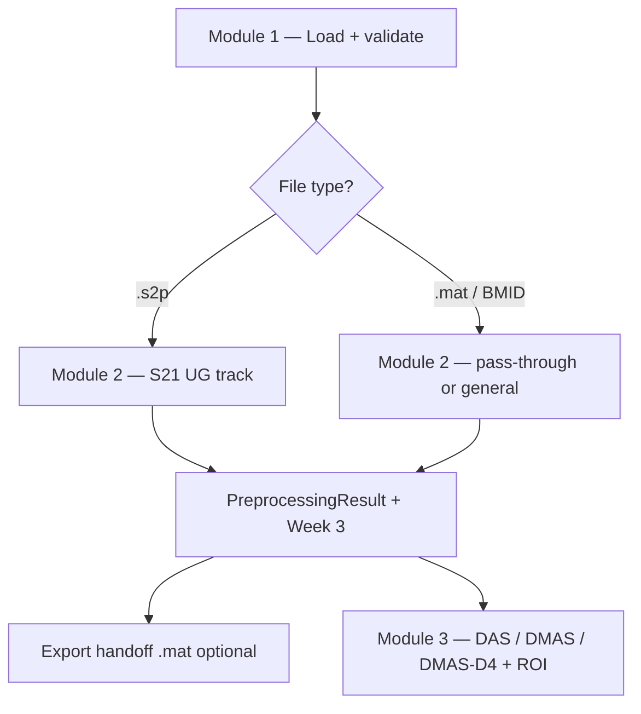
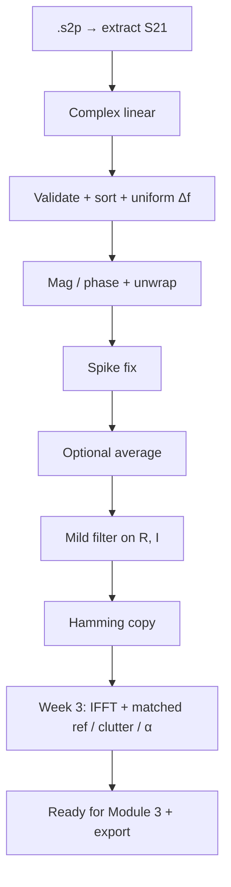
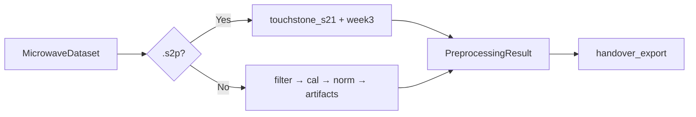

# Microwave Imaging Framework

Desktop **PySide6** app for microwave breast-imaging workflows:

1. **Data Acquisition** — load & validate `.mat` / Touchstone  
2. **Signal Preprocessing** — clean S21 (or pass-through for already-clean data)  
3. **Reconstruction** — DAS / DMAS / DMAS-D4 + ROI  

| Path | Typical input | Module 2 | Module 3 |
|------|----------------|----------|----------|
| **UM-BMID** | `fd_data_s21_adi.mat` (200 scans) | **Pass-through (all none)** — `_adi` is already cleaned | Imaging + ROI / Auto Tweak |
| **UG `.s2p` brief** | Touchstone `.s2p` | Full S21 Week 1–3 pipeline | Handoff `.mat` → reconstruct |

Brief PDFs (project folder): `Module_2_Signal_Preprocessing_Bullets_for_UG_Students.pdf`, `Signal Preprocessing_21082026.pdf` — these describe the **`.s2p`** track, not BMID cleaning.

---

## Quick start

```bash
cd project
python -m venv .venv_local
.\.venv_local\Scripts\activate          # Windows
pip install -r requirements.txt
python main.py
```

```bash
python -m unittest discover -s tests -v
```

Sample files: `python datasets/generate_sample_data.py`

### BMID demo (already-clean cube)

1. Place `fd_data_s21_adi.mat` + `md_list_s21_adi.mat` in `datasets/` (large cubes are gitignored).  
2. Module 1 → load cube → pick a scan.  
3. Module 2 → **Preset: BMID pass-through** (auto-applied) → Run.  
4. Module 3 → radius **18 cm**, FOV **12×12 cm**, `c = 3e8`, Peak ROI, Prefer/Force **DMAS-D4**.

### Touchstone `.s2p` demo (UG brief)

1. Module 1 → load `sample_touchstone.s2p` (or your file).  
2. Module 2 → **Preset: .s2p brief defaults** → optional repeated/reference → Run → Export Module 3 Handoff.  
3. Module 3 → reconstruct from processed data.

---

## Folder structure

```
project/
  main.py
  requirements.txt
  gui/                 # Module 1–3 panels + shared styles
  data_loader/         # .mat, BMID, Touchstone → MicrowaveDataset
  preprocessing/       # S21 track, Week 3, general pipeline, handoff export
  reconstruction/      # IFFT, DAS, DMAS, DMAS-D4, Auto Tweak
  quality/  roi/  utils/
  datasets/  results/  tests/
  docs/canvases/       # Flowchart canvas (also on GitHub)
```

---

## Flowcharts

Interactive canvas: [`docs/canvases/module1-module2-flowchart.canvas.tsx`](docs/canvases/module1-module2-flowchart.canvas.tsx)  
(On GitHub, open the **`breawave`** branch — default remote branch may be `master`.)

### End-to-end



### `.s2p` preprocessing (UG brief)



### Module 2 router



More diagrams (Week 3 detail, MATLAB path, handoff): see earlier README history / canvas tabs.

---

## Module notes

### 1 — Data Acquisition

- Entry: `data_loader/loader.py` → `MicrowaveDataset`
- MATLAB legacy + HDF5 v7.3; Touchstone via `scikit-rf`
- BMID: scan picker (tumor / healthy)

### 2 — Preprocessing

| Track | When | Code |
|-------|------|------|
| S21 UG | `.s2p` | `preprocessing/touchstone_s21.py`, `week3_time_domain.py` |
| General | `.mat` / other | `preprocessing_pipeline.py` stages |
| Handoff | After run | `handover_export.py` + GUI **Export Module 3 Handoff** |

GUI presets:

- **BMID pass-through** — all cleaning `none` / Week 3 off  
- **`.s2p` brief defaults** — mild Savitzky–Golay + Week 3 on  

Checklist vs the UG PDFs: all Module 2 brief items are **Done** (Week 1–3).  
Module 3 still defaults to **filtered `S21(f)`** in the GUI; Hamming / time-domain are in metadata and the handoff file.

### 3 — Reconstruction

- Beamformers: DAS, DMAS, DMAS-D4  
- Auto Tweak, ROI modes, BMID geometry (18 cm, 355° arc, phase-delay option)  
- Session reports auto-saved under `results/`

---

## Errors

All framework errors subclass `MicrowaveFrameworkError` (`utils/exceptions.py`). Invalid files show in the Status Log and a dialog; the app should not crash.

---

## Documentation

| Doc | Contents |
|-----|----------|
| [`docs/PROJECT_PROGRESS.md`](docs/PROJECT_PROGRESS.md) | What we built (Modules 1–3, BMID vs `.s2p`, UI, next steps) |
| [`docs/BMID_DEVELOPMENT_STEPS.md`](docs/BMID_DEVELOPMENT_STEPS.md) | BMID integration + experiment log |
| [`docs/canvases/module1-module2-flowchart.canvas.tsx`](docs/canvases/module1-module2-flowchart.canvas.tsx) | Interactive flowchart |

---

## Next work

1. Use Hamming / Week 3 time-domain as the default Module 3 reconstruction input when present.  
2. Continue BMID localization tuning (see BMID development steps).
